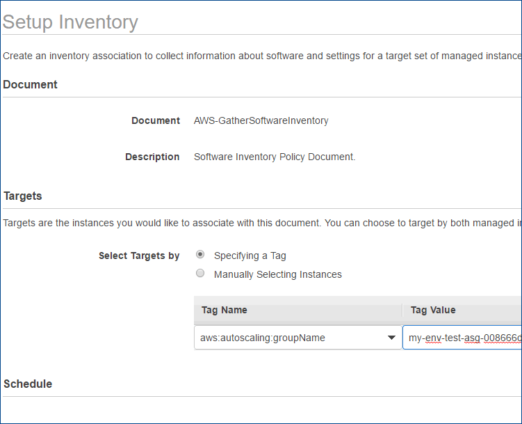
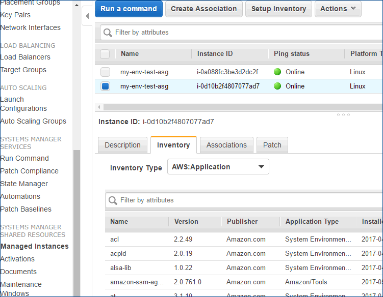

`user_data`に`ssm-agent`をインストールする処理を入れる

```bash
#---snip---

# Install JQ JSON parser
yum install -y jq aws-cli vim-enhanced
# Get the current region from the instance metadata
region=$(curl -s http://169.254.169.254/latest/dynamic/instance-identity/document | jq -r .region)
# Install the SSM agent RPM
yum install -y https://amazon-ssm-$region.s3.amazonaws.com/latest/linux_amd64/amazon-ssm-agent.rpm

#---snip---
```

externalの接続が必要なので、instanceが外にアクセスできるようにigwを持つroute tableにsubnetをassociateしている必要がある。  
internalの場合はs3に置きvpc-endpointなどでつなげることも可能のはず。

setup inventory(create-association)はterraform(0.9.3)ではまだtargetの指定ができなくautoscaling groupでの適応が難しい。こちらはマネジメントコンソールから手動で行う必要がある。


## setup inventory
 Managed Instances -> Setup Inventory


 Manged Instances -> Select Instance -> Inventory tab -> Inventory Type -> AWS:Application

